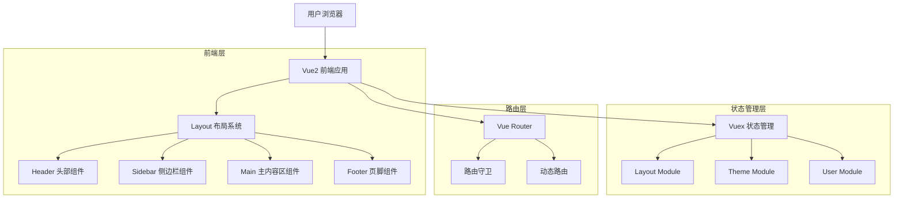
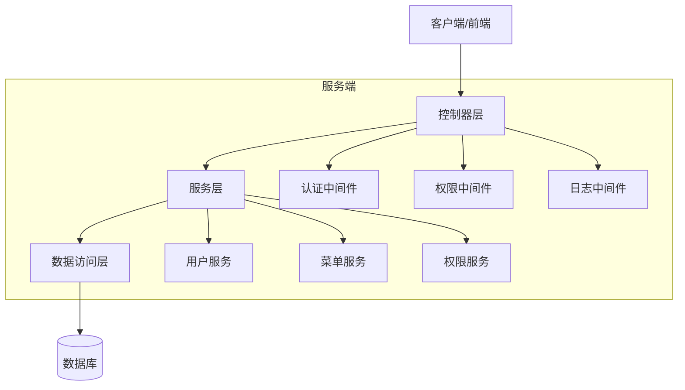
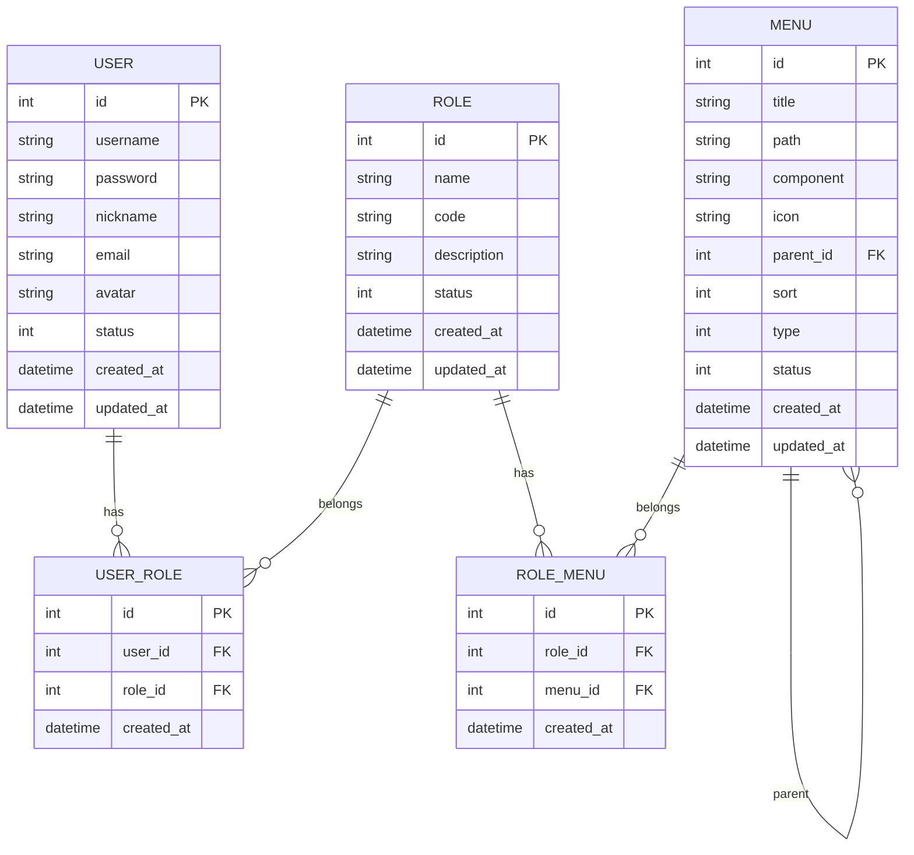

# Vue2 后台管理系统 Layout 重构技术架构文档

## 1. 架构设计



## 2. 技术描述

- **前端**: Vue@2.6 + Element UI@2.15 + Vue Router@3.x + Vuex@3.x
- **样式**: SCSS + CSS Variables + PostCSS
- **构建**: Vue CLI@4.x + Webpack@4.x
- **开发工具**: ESLint + Prettier + Husky

## 3. 路由定义

| 路由 | 用途 |
|------|------|
| / | 重定向到 /dashboard |
| /dashboard | 仪表盘页面，系统首页 |
| /login | 登录页面，用户认证 |
| /user/profile | 用户资料页面，个人信息管理 |
| /user/settings | 用户设置页面，个性化配置 |
| /system/users | 用户管理页面，系统用户管理 |
| /system/roles | 角色管理页面，权限角色管理 |
| /system/menus | 菜单管理页面，系统菜单配置 |
| /404 | 404 错误页面 |
| /401 | 401 未授权页面 |

## 4. API 定义

### 4.1 核心 API

#### 用户认证相关
```
POST /api/auth/login
```

请求参数:
| 参数名 | 参数类型 | 是否必填 | 描述 |
|--------|----------|----------|------|
| username | string | true | 用户名 |
| password | string | true | 密码 |

响应参数:
| 参数名 | 参数类型 | 描述 |
|--------|----------|------|
| code | number | 响应状态码 |
| data | object | 响应数据 |
| data.token | string | 访问令牌 |
| data.userInfo | object | 用户信息 |
| message | string | 响应消息 |

示例:
```json
{
  "code": 200,
  "data": {
    "token": "eyJhbGciOiJIUzI1NiIsInR5cCI6IkpXVCJ9...",
    "userInfo": {
      "id": 1,
      "username": "admin",
      "nickname": "管理员",
      "avatar": "/avatars/admin.jpg",
      "roles": ["admin"]
    }
  },
  "message": "登录成功"
}
```

#### 用户信息获取
```
GET /api/user/info
```

请求头:
| 参数名 | 参数类型 | 是否必填 | 描述 |
|--------|----------|----------|------|
| Authorization | string | true | Bearer Token |

响应参数:
| 参数名 | 参数类型 | 描述 |
|--------|----------|------|
| code | number | 响应状态码 |
| data | object | 用户信息 |
| message | string | 响应消息 |

#### 菜单数据获取
```
GET /api/user/menus
```

请求头:
| 参数名 | 参数类型 | 是否必填 | 描述 |
|--------|----------|----------|------|
| Authorization | string | true | Bearer Token |

响应参数:
| 参数名 | 参数类型 | 描述 |
|--------|----------|------|
| code | number | 响应状态码 |
| data | array | 菜单列表 |
| message | string | 响应消息 |

示例:
```json
{
  "code": 200,
  "data": [
    {
      "id": 1,
      "title": "仪表盘",
      "path": "/dashboard",
      "icon": "el-icon-s-home",
      "children": []
    },
    {
      "id": 2,
      "title": "系统管理",
      "path": "/system",
      "icon": "el-icon-setting",
      "children": [
        {
          "id": 21,
          "title": "用户管理",
          "path": "/system/users",
          "icon": "el-icon-user"
        }
      ]
    }
  ],
  "message": "获取成功"
}
```

## 5. 服务架构图



## 6. 数据模型

### 6.1 数据模型定义



### 6.2 数据定义语言

#### 用户表 (users)
```sql
-- 创建用户表
CREATE TABLE users (
    id INT PRIMARY KEY AUTO_INCREMENT,
    username VARCHAR(50) UNIQUE NOT NULL COMMENT '用户名',
    password VARCHAR(255) NOT NULL COMMENT '密码',
    nickname VARCHAR(50) NOT NULL COMMENT '昵称',
    email VARCHAR(100) COMMENT '邮箱',
    avatar VARCHAR(255) COMMENT '头像',
    status TINYINT DEFAULT 1 COMMENT '状态：1-启用，0-禁用',
    created_at TIMESTAMP DEFAULT CURRENT_TIMESTAMP COMMENT '创建时间',
    updated_at TIMESTAMP DEFAULT CURRENT_TIMESTAMP ON UPDATE CURRENT_TIMESTAMP COMMENT '更新时间'
) COMMENT='用户表';

-- 创建索引
CREATE INDEX idx_username ON users(username);
CREATE INDEX idx_status ON users(status);
CREATE INDEX idx_created_at ON users(created_at);

-- 初始化数据
INSERT INTO users (username, password, nickname, email, avatar) VALUES
('admin', '$2b$10$92IXUNpkjO0rOQ5byMi.Ye4oKoEa3Ro9llC/.og/at2.uheWG/igi', '系统管理员', 'admin@example.com', '/avatars/admin.jpg'),
('user', '$2b$10$92IXUNpkjO0rOQ5byMi.Ye4oKoEa3Ro9llC/.og/at2.uheWG/igi', '普通用户', 'user@example.com', '/avatars/user.jpg');
```

#### 角色表 (roles)
```sql
-- 创建角色表
CREATE TABLE roles (
    id INT PRIMARY KEY AUTO_INCREMENT,
    name VARCHAR(50) NOT NULL COMMENT '角色名称',
    code VARCHAR(50) UNIQUE NOT NULL COMMENT '角色编码',
    description TEXT COMMENT '角色描述',
    status TINYINT DEFAULT 1 COMMENT '状态：1-启用，0-禁用',
    created_at TIMESTAMP DEFAULT CURRENT_TIMESTAMP COMMENT '创建时间',
    updated_at TIMESTAMP DEFAULT CURRENT_TIMESTAMP ON UPDATE CURRENT_TIMESTAMP COMMENT '更新时间'
) COMMENT='角色表';

-- 创建索引
CREATE INDEX idx_code ON roles(code);
CREATE INDEX idx_status ON roles(status);

-- 初始化数据
INSERT INTO roles (name, code, description) VALUES
('超级管理员', 'admin', '系统超级管理员，拥有所有权限'),
('普通用户', 'user', '普通用户，拥有基础权限');
```

#### 用户角色关联表 (user_roles)
```sql
-- 创建用户角色关联表
CREATE TABLE user_roles (
    id INT PRIMARY KEY AUTO_INCREMENT,
    user_id INT NOT NULL COMMENT '用户ID',
    role_id INT NOT NULL COMMENT '角色ID',
    created_at TIMESTAMP DEFAULT CURRENT_TIMESTAMP COMMENT '创建时间',
    FOREIGN KEY (user_id) REFERENCES users(id) ON DELETE CASCADE,
    FOREIGN KEY (role_id) REFERENCES roles(id) ON DELETE CASCADE,
    UNIQUE KEY uk_user_role (user_id, role_id)
) COMMENT='用户角色关联表';

-- 创建索引
CREATE INDEX idx_user_id ON user_roles(user_id);
CREATE INDEX idx_role_id ON user_roles(role_id);

-- 初始化数据
INSERT INTO user_roles (user_id, role_id) VALUES
(1, 1), -- admin 用户分配 admin 角色
(2, 2); -- user 用户分配 user 角色
```

#### 菜单表 (menus)
```sql
-- 创建菜单表
CREATE TABLE menus (
    id INT PRIMARY KEY AUTO_INCREMENT,
    title VARCHAR(50) NOT NULL COMMENT '菜单标题',
    path VARCHAR(255) COMMENT '路由路径',
    component VARCHAR(255) COMMENT '组件路径',
    icon VARCHAR(50) COMMENT '图标',
    parent_id INT DEFAULT 0 COMMENT '父级菜单ID',
    sort INT DEFAULT 0 COMMENT '排序',
    type TINYINT DEFAULT 1 COMMENT '类型：1-菜单，2-按钮',
    status TINYINT DEFAULT 1 COMMENT '状态：1-启用，0-禁用',
    created_at TIMESTAMP DEFAULT CURRENT_TIMESTAMP COMMENT '创建时间',
    updated_at TIMESTAMP DEFAULT CURRENT_TIMESTAMP ON UPDATE CURRENT_TIMESTAMP COMMENT '更新时间'
) COMMENT='菜单表';

-- 创建索引
CREATE INDEX idx_parent_id ON menus(parent_id);
CREATE INDEX idx_sort ON menus(sort);
CREATE INDEX idx_status ON menus(status);

-- 初始化数据
INSERT INTO menus (title, path, component, icon, parent_id, sort, type) VALUES
('仪表盘', '/dashboard', 'Dashboard/index', 'el-icon-s-home', 0, 1, 1),
('系统管理', '/system', 'Layout', 'el-icon-setting', 0, 2, 1),
('用户管理', '/system/users', 'System/Users/index', 'el-icon-user', 2, 1, 1),
('角色管理', '/system/roles', 'System/Roles/index', 'el-icon-s-custom', 2, 2, 1),
('菜单管理', '/system/menus', 'System/Menus/index', 'el-icon-menu', 2, 3, 1),
('个人中心', '/user', 'Layout', 'el-icon-user-solid', 0, 3, 1),
('个人资料', '/user/profile', 'User/Profile/index', 'el-icon-edit', 6, 1, 1),
('个人设置', '/user/settings', 'User/Settings/index', 'el-icon-s-tools', 6, 2, 1);
```

#### 角色菜单关联表 (role_menus)
```sql
-- 创建角色菜单关联表
CREATE TABLE role_menus (
    id INT PRIMARY KEY AUTO_INCREMENT,
    role_id INT NOT NULL COMMENT '角色ID',
    menu_id INT NOT NULL COMMENT '菜单ID',
    created_at TIMESTAMP DEFAULT CURRENT_TIMESTAMP COMMENT '创建时间',
    FOREIGN KEY (role_id) REFERENCES roles(id) ON DELETE CASCADE,
    FOREIGN KEY (menu_id) REFERENCES menus(id) ON DELETE CASCADE,
    UNIQUE KEY uk_role_menu (role_id, menu_id)
) COMMENT='角色菜单关联表';

-- 创建索引
CREATE INDEX idx_role_id ON role_menus(role_id);
CREATE INDEX idx_menu_id ON role_menus(menu_id);

-- 初始化数据（admin 角色拥有所有菜单权限）
INSERT INTO role_menus (role_id, menu_id) 
SELECT 1, id FROM menus WHERE status = 1;

-- 普通用户只有基础权限
INSERT INTO role_menus (role_id, menu_id) VALUES
(2, 1), -- 仪表盘
(2, 6), -- 个人中心
(2, 7), -- 个人资料
(2, 8); -- 个人设置
```

## 7. 组件架构设计

### 7.1 Layout 组件层次结构

```
Layout/
├── index.vue                 # 主布局容器
├── components/
│   ├── Header/
│   │   ├── index.vue         # 头部容器组件
│   │   ├── Logo.vue          # Logo 组件
│   │   ├── Navbar.vue        # 导航栏组件
│   │   ├── UserDropdown.vue  # 用户下拉菜单
│   │   ├── ToolBar.vue       # 工具栏组件
│   │   └── Breadcrumb.vue    # 面包屑导航
│   ├── Sidebar/
│   │   ├── index.vue         # 侧边栏容器
│   │   ├── SidebarMenu.vue   # 菜单组件
│   │   ├── SidebarItem.vue   # 菜单项组件
│   │   └── SidebarLogo.vue   # 侧边栏 Logo
│   ├── Main/
│   │   ├── index.vue         # 主内容区容器
│   │   ├── AppMain.vue       # 路由视图容器
│   │   └── TabsView.vue      # 标签页组件
│   ├── Footer/
│   │   └── index.vue         # 页脚组件
│   └── Common/
│       ├── LoadingBar.vue    # 页面加载条
│       ├── BackTop.vue       # 回到顶部
│       ├── FullScreen.vue    # 全屏组件
│       └── ThemeSwitch.vue   # 主题切换
├── hooks/
│   ├── useLayout.js          # 布局逻辑 Hook
│   ├── useResize.js          # 响应式处理 Hook
│   ├── useTheme.js           # 主题切换 Hook
│   └── useBreadcrumb.js      # 面包屑 Hook
└── styles/
    ├── layout.scss           # 布局样式
    ├── variables.scss        # 样式变量
    ├── mixins.scss           # 样式混入
    └── themes/
        ├── light.scss        # 亮色主题
        └── dark.scss         # 暗色主题
```

### 7.2 状态管理架构

```javascript
// store/index.js
import Vue from 'vue'
import Vuex from 'vuex'
import layout from './modules/layout'
import theme from './modules/theme'
import user from './modules/user'
import permission from './modules/permission'
import tagsView from './modules/tagsView'
import getters from './getters'

Vue.use(Vuex)

const store = new Vuex.Store({
  modules: {
    layout,
    theme,
    user,
    permission,
    tagsView
  },
  getters
})

export default store
```

### 7.3 路由架构设计

```javascript
// router/index.js
import Vue from 'vue'
import VueRouter from 'vue-router'
import Layout from '@/components/common/Layout'

Vue.use(VueRouter)

// 静态路由
export const constantRoutes = [
  {
    path: '/login',
    component: () => import('@/views/Login/index'),
    hidden: true
  },
  {
    path: '/404',
    component: () => import('@/views/404/index'),
    hidden: true
  },
  {
    path: '/',
    component: Layout,
    redirect: '/dashboard',
    children: [
      {
        path: 'dashboard',
        name: 'Dashboard',
        component: () => import('@/views/Dashboard/index'),
        meta: { title: '仪表盘', icon: 'el-icon-s-home' }
      }
    ]
  }
]

// 动态路由
export const asyncRoutes = [
  {
    path: '/system',
    component: Layout,
    redirect: '/system/users',
    name: 'System',
    meta: { title: '系统管理', icon: 'el-icon-setting', roles: ['admin'] },
    children: [
      {
        path: 'users',
        name: 'SystemUsers',
        component: () => import('@/views/System/Users/index'),
        meta: { title: '用户管理', icon: 'el-icon-user' }
      },
      {
        path: 'roles',
        name: 'SystemRoles',
        component: () => import('@/views/System/Roles/index'),
        meta: { title: '角色管理', icon: 'el-icon-s-custom' }
      },
      {
        path: 'menus',
        name: 'SystemMenus',
        component: () => import('@/views/System/Menus/index'),
        meta: { title: '菜单管理', icon: 'el-icon-menu' }
      }
    ]
  },
  {
    path: '/user',
    component: Layout,
    redirect: '/user/profile',
    name: 'User',
    meta: { title: '个人中心', icon: 'el-icon-user-solid' },
    children: [
      {
        path: 'profile',
        name: 'UserProfile',
        component: () => import('@/views/User/Profile/index'),
        meta: { title: '个人资料', icon: 'el-icon-edit' }
      },
      {
        path: 'settings',
        name: 'UserSettings',
        component: () => import('@/views/User/Settings/index'),
        meta: { title: '个人设置', icon: 'el-icon-s-tools' }
      }
    ]
  },
  { path: '*', redirect: '/404', hidden: true }
]

const createRouter = () => new VueRouter({
  mode: 'history',
  scrollBehavior: () => ({ y: 0 }),
  routes: constantRoutes
})

const router = createRouter()

export function resetRouter() {
  const newRouter = createRouter()
  router.matcher = newRouter.matcher
}

export default router
```

## 8. 性能优化方案

### 8.1 代码分割策略
```javascript
// 路由懒加载
const Dashboard = () => import(/* webpackChunkName: "dashboard" */ '@/views/Dashboard/index')

// 组件懒加载
const UserDropdown = () => import(/* webpackChunkName: "layout" */ './UserDropdown')

// 动态导入
const loadComponent = (componentName) => {
  return () => import(`@/components/${componentName}`)
}
```

### 8.2 缓存策略
```javascript
// 路由缓存配置
export default {
  name: 'Layout',
  computed: {
    cachedViews() {
      return this.$store.state.tagsView.cachedViews
    }
  },
  render(h) {
    return h('keep-alive', {
      props: {
        include: this.cachedViews
      }
    }, [h('router-view')])
  }
}
```

### 8.3 虚拟滚动优化
```javascript
// 长列表虚拟滚动
import VirtualList from '@tanstack/vue-virtual'

export default {
  components: {
    VirtualList
  },
  template: `
    <VirtualList
      :items="items"
      :item-size="50"
      :height="400"
      v-slot="{ item, index }"
    >
      <div :key="index" class="list-item">
        {{ item.name }}
      </div>
    </VirtualList>
  `
}
```

## 9. 安全策略

### 9.1 认证授权
```javascript
// JWT Token 处理
import axios from 'axios'
import store from '@/store'
import { getToken } from '@/utils/auth'

// 请求拦截器
axios.interceptors.request.use(
  config => {
    const token = getToken()
    if (token) {
      config.headers['Authorization'] = `Bearer ${token}`
    }
    return config
  },
  error => {
    return Promise.reject(error)
  }
)

// 响应拦截器
axios.interceptors.response.use(
  response => {
    return response.data
  },
  error => {
    if (error.response?.status === 401) {
      store.dispatch('user/logout')
      location.reload()
    }
    return Promise.reject(error)
  }
)
```

### 9.2 权限控制
```javascript
// 路由权限守卫
router.beforeEach(async (to, from, next) => {
  const hasToken = getToken()
  
  if (hasToken) {
    if (to.path === '/login') {
      next({ path: '/' })
    } else {
      const hasRoles = store.getters.roles && store.getters.roles.length > 0
      if (hasRoles) {
        next()
      } else {
        try {
          const { roles } = await store.dispatch('user/getInfo')
          const accessRoutes = await store.dispatch('permission/generateRoutes', roles)
          router.addRoutes(accessRoutes)
          next({ ...to, replace: true })
        } catch (error) {
          await store.dispatch('user/resetToken')
          next(`/login?redirect=${to.path}`)
        }
      }
    }
  } else {
    if (whiteList.indexOf(to.path) !== -1) {
      next()
    } else {
      next(`/login?redirect=${to.path}`)
    }
  }
})
```

## 10. 监控和日志

### 10.1 错误监控
```javascript
// 全局错误处理
Vue.config.errorHandler = (err, vm, info) => {
  console.error('Vue Error:', err)
  console.error('Component:', vm)
  console.error('Info:', info)
  
  // 发送错误报告
  reportError({
    error: err.message,
    stack: err.stack,
    component: vm.$options.name,
    info: info,
    url: window.location.href,
    userAgent: navigator.userAgent,
    timestamp: new Date().toISOString()
  })
}

// 异步错误捕获
window.addEventListener('unhandledrejection', event => {
  console.error('Unhandled Promise Rejection:', event.reason)
  reportError({
    type: 'unhandledrejection',
    error: event.reason,
    timestamp: new Date().toISOString()
  })
})
```

### 10.2 性能监控
```javascript
// 性能监控
const performanceObserver = new PerformanceObserver((list) => {
  for (const entry of list.getEntries()) {
    if (entry.entryType === 'navigation') {
      reportPerformance({
        type: 'navigation',
        loadTime: entry.loadEventEnd - entry.loadEventStart,
        domContentLoaded: entry.domContentLoadedEventEnd - entry.domContentLoadedEventStart,
        firstPaint: entry.responseEnd - entry.requestStart
      })
    }
  }
})

performanceObserver.observe({ entryTypes: ['navigation', 'paint'] })
```

## 11. 部署配置

### 11.1 构建配置
```javascript
// vue.config.js
module.exports = {
  publicPath: process.env.NODE_ENV === 'production' ? '/admin/' : '/',
  outputDir: 'dist',
  assetsDir: 'static',
  lintOnSave: process.env.NODE_ENV === 'development',
  productionSourceMap: false,
  
  configureWebpack: {
    resolve: {
      alias: {
        '@': resolve('src')
      }
    },
    optimization: {
      splitChunks: {
        chunks: 'all',
        cacheGroups: {
          libs: {
            name: 'chunk-libs',
            test: /[\\/]node_modules[\\/]/,
            priority: 10,
            chunks: 'initial'
          },
          elementUI: {
            name: 'chunk-elementUI',
            priority: 20,
            test: /[\\/]node_modules[\\/]_?element-ui(.*)/
          },
          commons: {
            name: 'chunk-commons',
            test: resolve('src/components'),
            minChunks: 3,
            priority: 5,
            reuseExistingChunk: true
          }
        }
      }
    }
  },
  
  chainWebpack(config) {
    config.plugins.delete('preload')
    config.plugins.delete('prefetch')
    
    // 设置 svg-sprite-loader
    config.module
      .rule('svg')
      .exclude.add(resolve('src/icons'))
      .end()
    config.module
      .rule('icons')
      .test(/\.svg$/)
      .include.add(resolve('src/icons'))
      .end()
      .use('svg-sprite-loader')
      .loader('svg-sprite-loader')
      .options({
        symbolId: 'icon-[name]'
      })
      .end()
  }
}
```

### 11.2 环境配置
```bash
# .env.development
NODE_ENV = 'development'
VUE_APP_BASE_API = 'http://localhost:3000/api'
VUE_APP_TITLE = '管理系统 - 开发环境'

# .env.production
NODE_ENV = 'production'
VUE_APP_BASE_API = 'https://api.example.com'
VUE_APP_TITLE = '管理系统'
```

通过以上技术架构设计，可以构建一个高性能、可维护、可扩展的 Vue2 后台管理系统 Layout 布局。