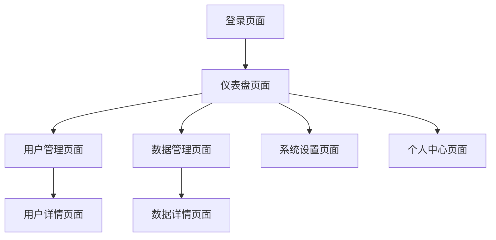

# Vue2后台管理系统产品需求文档

## 1. 产品概述

本项目旨在构建一个功能完善、用户体验优秀的Vue2 + JavaScript后台管理系统。系统将为企业提供高效的数据管理、用户权限控制、业务流程管理等核心功能，帮助企业提升管理效率和决策质量。

该系统面向企业管理人员、运营人员和系统管理员，通过直观的界面设计和强大的功能模块，实现企业内部各类数据的统一管理和可视化展示。

## 2. 核心功能

### 2.1 用户角色

| 角色 | 注册方式 | 核心权限 |
|------|----------|----------|
| 系统管理员 | 系统初始化创建 | 用户管理、权限配置、系统设置等全部功能 |
| 部门管理员 | 管理员邀请注册 | 部门数据管理、部门用户管理、报表查看 |
| 普通用户 | 邀请码注册 | 基础数据录入、个人信息管理、数据查看 |

### 2.2 功能模块

我们的后台管理系统包含以下主要页面：

1. **仪表盘页面**：数据概览、图表展示、快捷操作入口
2. **用户管理页面**：用户列表、用户详情、权限分配、批量操作
3. **数据管理页面**：数据表格、搜索筛选、数据导入导出、批量编辑
4. **系统设置页面**：基础配置、权限管理、日志查看、系统监控
5. **个人中心页面**：个人信息、密码修改、操作记录、偏好设置
6. **登录注册页面**：用户认证、密码重置、验证码验证

### 2.3 页面详情

| 页面名称 | 模块名称 | 功能描述 |
|----------|----------|----------|
| 仪表盘页面 | 数据概览 | 展示关键业务指标、数据统计图表、趋势分析 |
| 仪表盘页面 | 快捷操作 | 提供常用功能的快速入口、待办事项提醒 |
| 用户管理页面 | 用户列表 | 分页展示用户信息、支持多条件搜索和筛选 |
| 用户管理页面 | 用户操作 | 新增、编辑、删除用户、批量导入导出 |
| 用户管理页面 | 权限管理 | 角色分配、权限设置、访问控制 |
| 数据管理页面 | 数据表格 | 动态表格展示、排序、分页、列配置 |
| 数据管理页面 | 数据操作 | CRUD操作、批量处理、数据验证 |
| 数据管理页面 | 导入导出 | Excel/CSV文件处理、模板下载、错误提示 |
| 系统设置页面 | 基础配置 | 系统参数设置、业务规则配置 |
| 系统设置页面 | 日志管理 | 操作日志查看、系统日志监控、异常追踪 |
| 个人中心页面 | 个人信息 | 用户资料编辑、头像上传、联系方式管理 |
| 个人中心页面 | 安全设置 | 密码修改、二次验证、登录记录 |
| 登录注册页面 | 用户认证 | 登录验证、注册流程、密码重置 |

## 3. 核心流程

**管理员操作流程：**
系统管理员登录后，首先进入仪表盘查看系统整体运行状况，然后可以进入用户管理模块进行用户和权限管理，或进入系统设置进行系统配置和维护。

**普通用户操作流程：**
普通用户登录后进入仪表盘查看个人相关数据，然后根据权限进入相应的数据管理模块进行日常操作，也可以进入个人中心管理个人信息。

## 4. 用户界面设计

### 4.1 设计风格

- **主色调**：#409EFF（Element UI蓝色）、#67C23A（成功绿色）
- **辅助色**：#E6A23C（警告橙色）、#F56C6C（危险红色）、#909399（信息灰色）
- **按钮样式**：圆角按钮，支持多种尺寸和状态
- **字体**：系统默认字体，标题14-16px，正文12-14px
- **布局风格**：左侧导航 + 顶部面包屑的经典后台布局
- **图标风格**：使用Element UI图标库，简洁现代

### 4.2 页面设计概览

| 页面名称 | 模块名称 | UI元素 |
|----------|----------|--------|
| 仪表盘页面 | 数据概览 | 卡片式布局，使用ECharts图表，蓝白配色，响应式网格系统 |
| 仪表盘页面 | 快捷操作 | 图标按钮组，悬停效果，统一的视觉层次 |
| 用户管理页面 | 用户列表 | Element UI表格组件，分页器，搜索框，操作按钮 |
| 用户管理页面 | 用户操作 | 模态框表单，表单验证，确认对话框 |
| 数据管理页面 | 数据表格 | 可配置列表，排序图标，筛选器，批量选择 |
| 系统设置页面 | 配置表单 | 标签页布局，表单组件，保存提示 |
| 个人中心页面 | 个人信息 | 左右分栏布局，头像上传组件，表单验证 |
| 登录注册页面 | 认证表单 | 居中卡片布局，渐变背景，输入框图标 |

### 4.3 响应式设计

系统采用桌面优先的响应式设计，支持1200px以上的桌面显示器，同时兼容平板设备（768px-1200px）。针对移动端进行了触摸交互优化，确保在各种设备上都能提供良好的用户体验。