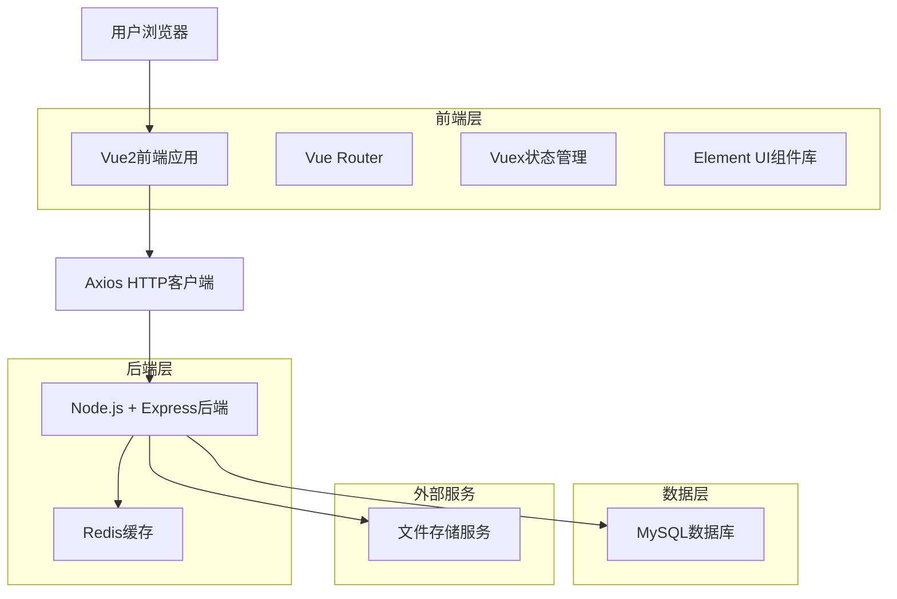
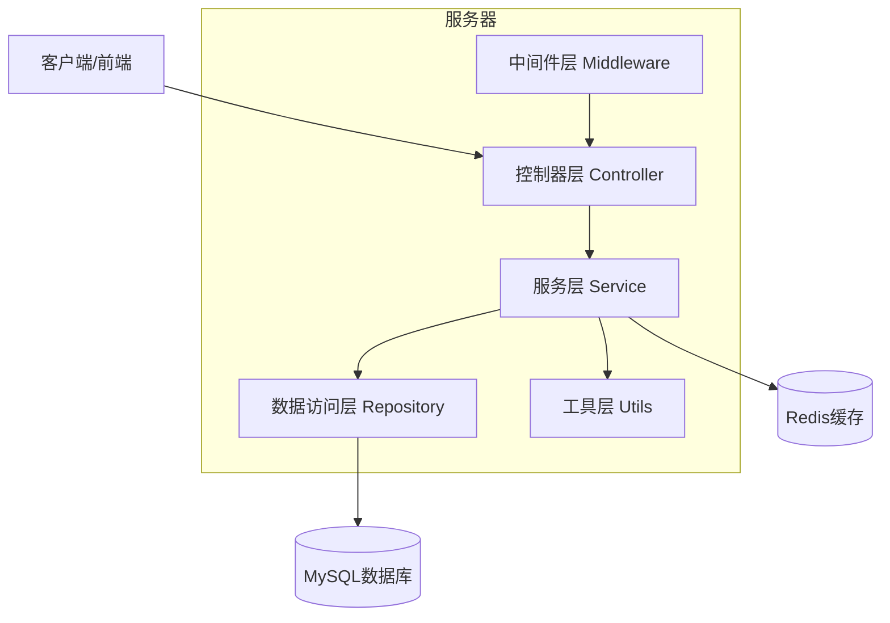
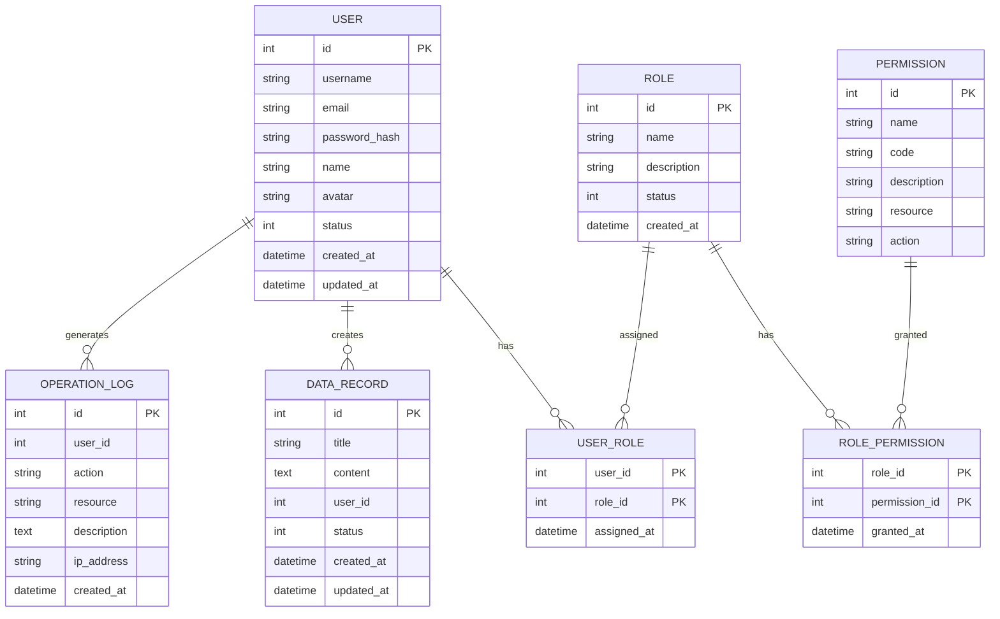

# Vue2后台管理系统技术架构文档

## 1. 架构设计



## 2. 技术描述

* **前端**: Vue\@2.6.14 + Vue Router\@3.5.4 + Vuex\@3.6.2 + Element UI\@2.15.13 + Axios\@1.6.0 + Webpack\@4.46.0

* **后端**: Node.js\@18+ + Express\@4.18.0 + MySQL\@8.0 + Redis\@7.0

* **构建工具**: Vue CLI\@5.0.8 + ESLint + Prettier

* **开发工具**: VS Code + Vue DevTools + Postman

## 3. 路由定义

| 路由         | 用途                 |
| ---------- | ------------------ |
| /login     | 登录页面，用户身份验证和授权     |
| /dashboard | 仪表盘首页，展示系统概览和关键指标  |
| /users     | 用户管理页面，用户列表和权限管理   |
| /users/:id | 用户详情页面，查看和编辑用户信息   |
| /data      | 数据管理页面，业务数据的CRUD操作 |
| /data/:id  | 数据详情页面，单条数据的详细信息   |
| /settings  | 系统设置页面，系统配置和参数管理   |
| /profile   | 个人中心页面，个人信息和偏好设置   |
| /404       | 404错误页面，处理无效路由     |

## 4. API定义

### 4.1 核心API

**用户认证相关**

```
POST /api/auth/login
```

请求参数:

| 参数名      | 参数类型   | 是否必需 | 描述     |
| -------- | ------ | ---- | ------ |
| username | string | true | 用户名或邮箱 |
| password | string | true | 用户密码   |
| captcha  | string | true | 验证码    |

响应参数:

| 参数名     | 参数类型    | 描述      |
| ------- | ------- | ------- |
| success | boolean | 请求是否成功  |
| token   | string  | JWT访问令牌 |
| user    | object  | 用户基本信息  |

请求示例:

```json
{
  "username": "admin@example.com",
  "password": "123456",
  "captcha": "ABCD"
}
```

**用户管理相关**

```
GET /api/users
POST /api/users
PUT /api/users/:id
DELETE /api/users/:id
```

**数据管理相关**

```
GET /api/data
POST /api/data
PUT /api/data/:id
DELETE /api/data/:id
```

**文件上传相关**

```
POST /api/upload
```

## 5. 服务器架构图



## 6. 数据模型

### 6.1 数据模型定义



### 6.2 数据定义语言

**用户表 (users)**

```sql
-- 创建用户表
CREATE TABLE users (
    id INT PRIMARY KEY AUTO_INCREMENT,
    username VARCHAR(50) UNIQUE NOT NULL,
    email VARCHAR(100) UNIQUE NOT NULL,
    password_hash VARCHAR(255) NOT NULL,
    name VARCHAR(100) NOT NULL,
    avatar VARCHAR(255),
    status TINYINT DEFAULT 1 COMMENT '1:正常 0:禁用',
    created_at TIMESTAMP DEFAULT CURRENT_TIMESTAMP,
    updated_at TIMESTAMP DEFAULT CURRENT_TIMESTAMP ON UPDATE CURRENT_TIMESTAMP
);

-- 创建索引
CREATE INDEX idx_users_username ON users(username);
CREATE INDEX idx_users_email ON users(email);
CREATE INDEX idx_users_status ON users(status);

-- 初始化管理员账户
INSERT INTO users (username, email, password_hash, name, status) VALUES 
('admin', 'admin@example.com', '$2b$10$hash_password_here', '系统管理员', 1);
```

**角色表 (roles)**

```sql
-- 创建角色表
CREATE TABLE roles (
    id INT PRIMARY KEY AUTO_INCREMENT,
    name VARCHAR(50) UNIQUE NOT NULL,
    description TEXT,
    status TINYINT DEFAULT 1,
    created_at TIMESTAMP DEFAULT CURRENT_TIMESTAMP
);

-- 初始化角色数据
INSERT INTO roles (name, description) VALUES 
('admin', '系统管理员'),
('manager', '部门管理员'),
('user', '普通用户');
```

**权限表 (permissions)**

```sql
-- 创建权限表
CREATE TABLE permissions (
    id INT PRIMARY KEY AUTO_INCREMENT,
    name VARCHAR(100) NOT NULL,
    code VARCHAR(50) UNIQUE NOT NULL,
    description TEXT,
    resource VARCHAR(50),
    action VARCHAR(20)
);

-- 初始化权限数据
INSERT INTO permissions (name, code, description, resource, action) VALUES 
('用户查看', 'user:read', '查看用户列表和详情', 'user', 'read'),
('用户创建', 'user:create', '创建新用户', 'user', 'create'),
('用户编辑', 'user:update', '编辑用户信息', 'user', 'update'),
('用户删除', 'user:delete', '删除用户', 'user', 'delete');
```

**数据记录表 (data\_records)**

```sql
-- 创建数据记录表
CREATE TABLE data_records (
    id INT PRIMARY KEY AUTO_INCREMENT,
    title VARCHAR(200) NOT NULL,
    content TEXT,
    user_id INT NOT NULL,
    status TINYINT DEFAULT 1,
    created_at TIMESTAMP DEFAULT CURRENT_TIMESTAMP,
    updated_at TIMESTAMP DEFAULT CURRENT_TIMESTAMP ON UPDATE CURRENT_TIMESTAMP,
    FOREIGN KEY (user_id) REFERENCES users(id)
);

-- 创建索引
CREATE INDEX idx_data_records_user_id ON data_records(user_id);
CREATE INDEX idx_data_records_status ON data_records(status);
CREATE INDEX idx_data_records_created_at ON data_records(created_at DESC);
```

**操作日志表 (operation\_logs)**

```sql
-- 创建操作日志表
CREATE TABLE operation_logs (
    id INT PRIMARY KEY AUTO_INCREMENT,
    user_id INT,
    action VARCHAR(50) NOT NULL,
    resource VARCHAR(50),
    description TEXT,
    ip_address VARCHAR(45),
    created_at TIMESTAMP DEFAULT CURRENT_TIMESTAMP,
    FOREIGN KEY (user_id) REFERENCES users(id)
);

-- 创建索引
CREATE INDEX idx_operation_logs_user_id ON operation_logs(user_id);
CREATE INDEX idx_operation_logs_action ON operation_logs(action);
CREATE INDEX idx_operation_logs_created_at ON operation_
```

